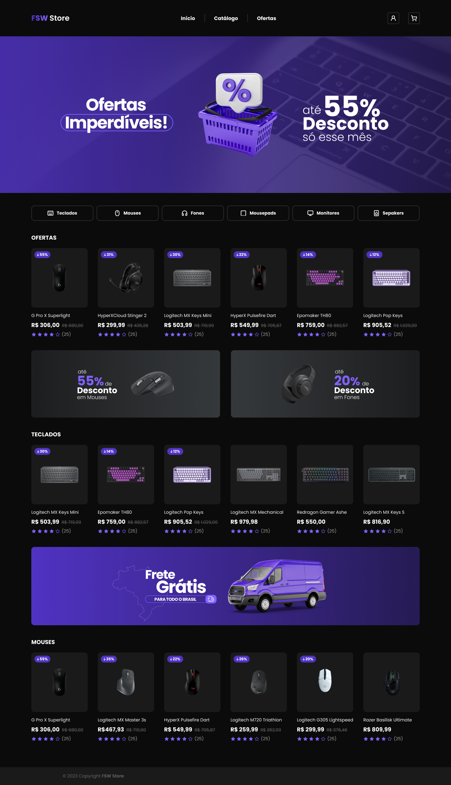

# FSW Store

Projeto desenvolvido durante o evento Fullstack Week, realizado pelo instrutor [Felipe Rocha](https://github.com/felipemotarocha), da [Fullstack Club](https://fullstackclub.io/). A aplicação foi desenvolvida utilizando [Next.js](https://nextjs.org), [TailwindCSS](https://tailwindcss.com), [shadcn-ui](https://ui.shadcn.com/), [next-auth](https://next-auth.js.org/), entre outros.